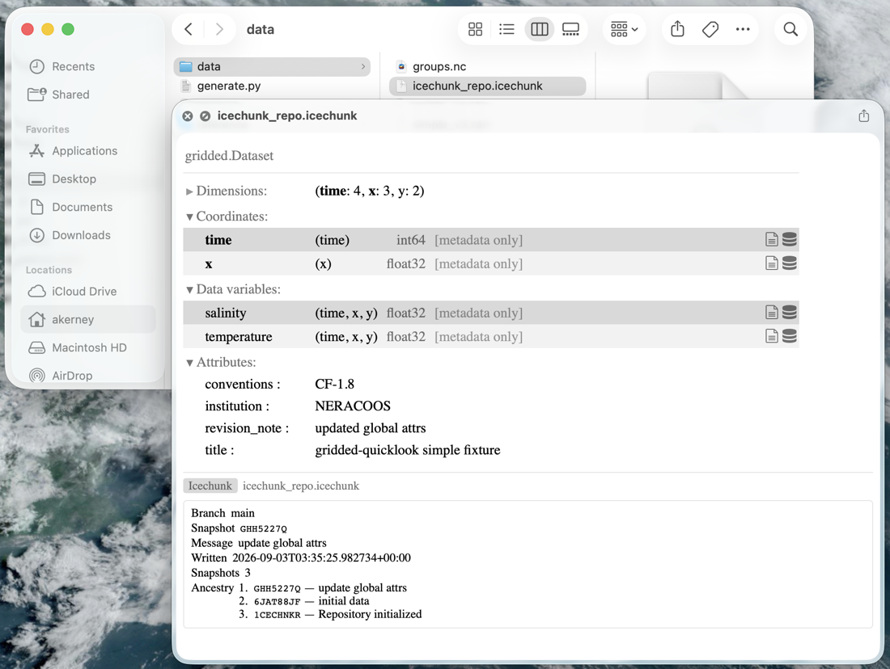

# GridLook

A macOS Quick Look app extension that previews gridded scientific data (NetCDF/HDF5 files, Zarr stores, and Icechunk repositories) as an
xarray-style dataset repr.



Previews are currently metadata only: dimensions, variables, dtypes, chunking,
attributes, and group hierarchy. Icechunk repositories additionally show the
commit history of their `main` branch.

## Installing

`mise run install-dev` from the repo should try to install things, or yell at you.

## Supported formats

| Kind             | Format               | Recognized by                                   | Notes                                          |
| ---------------- | -------------------- | ----------------------------------------------- | ---------------------------------------------- |
| File             | NetCDF-3 / NetCDF-4  | `.nc`, `.nc4`, `.cdf`                           | Groups (DataTree) supported                    |
| File             | HDF5                 | `.h5`, `.hdf5`, `.he5`                          | Read through the same netCDF-4 reader          |
| Directory store  | Zarr v2              | `.zgroup` / `.zarray` / `.zmetadata` at the root | Consolidated metadata used when present        |
| Directory store  | Zarr v3              | `zarr.json` at the root                          | Directory tree walked node by node             |
| Directory store  | Icechunk (spec v1/v2) | `snapshots/` plus `refs/` or `repo` at the root | Tip of `main`, plus its snapshot ancestry      |

Directory stores are dispatched on their **contents**, not their name, so a
store called anything at all previews correctly once Quick Look hands it
over. For the Finder to offer a preview in the first place, though, the
directory needs a recognized extension: the app declares `dev.gridlook.zarr`
(`.zarr`) and `dev.gridlook.icechunk` (`.icechunk`) as exported UTIs
conforming to `com.apple.package`.

## Layout

| Path                   | What it is                                                       |
| ---------------------- | ---------------------------------------------------------------- |
| `crates/gridlook-meta`  | Format readers → a format-agnostic `DatasetSummary`               |
| `crates/gridlook-html`  | Renders a `DatasetSummary` as a self-contained HTML document      |
| `crates/gridlook-ffi`   | C ABI (`staticlib`) linked into the app extension                 |
| `apple/`               | XcodeGen spec, the host app, and the Quick Look preview extension |
| `fixtures/`            | Fixture generator (`generate.py`); its output is not committed    |

The Icechunk reader lives behind `gridlook-meta`'s non-default `icechunk`
cargo feature (it pulls in a sizable dependency tree); `gridlook-ffi` enables
it, so the extension always has it.

## Development

Toolchains (Rust, cmake, uv, xcodegen, prek) are pinned in `mise.toml`:

```sh
mise install
```

Building the Xcode project additionally needs a **full Xcode install**, not
just the Command Line Tools (`xcode-select -p` must point at `Xcode.app`).
`xcodegen` alone works with only the CLT, so the Rust side and project
generation are usable without Xcode.

### Tasks

| Task                          | What it does                                            |
| ----------------------------- | ------------------------------------------------------- |
| `mise run test`               | Regenerate fixtures, then `cargo test --workspace`      |
| `mise run lint`               | `cargo fmt --check` + clippy                            |
| `mise run hooks`              | `prek run --all-files`                                  |
| `mise run fixtures`           | Generate `fixtures/data` + `fixtures/reference` (untracked) |
| `mise run sync-xarray-assets` | Re-copy xarray's repr CSS/SVG into `gridlook-html`       |
| `mise run xcodeproj`          | Generate `apple/GridLook.xcodeproj`             |
| `mise run build-appex`        | `xcodebuild` the extension (needs full Xcode)           |
| `mise run install-dev`        | `scripts/install-dev.sh`                                |
| `mise run preview`            | Reset/reload the Quick Look daemon                      |

To use the extension locally, `mise run install-dev`
builds it, ad-hoc signs it, and installs it into `~/Applications` (no Apple
Developer account or provisioning profile required).

Snapshot tests use [insta](https://insta.rs); run `cargo insta review` after
an intentional change. The Icechunk snapshot redacts snapshot ids and
timestamps, so regenerating fixtures does not churn it.

A `.devcontainer/` is provided for Linux work on the Rust crates. A Mac with
Xcode is needed to build or run the macOS app extension.

## Attribution

`crates/gridlook-html/assets/` contains xarray's HTML-repr stylesheet and
inline SVG icons, copied from
[pydata/xarray](https://github.com/pydata/xarray) (Apache License 2.0,
copyright the xarray contributors) so that previews are styled identically
to xarray's own `_repr_html_`. Refresh them with
`mise run sync-xarray-assets`.

## License

BSD-3-Clause. See [LICENSE](LICENSE).
