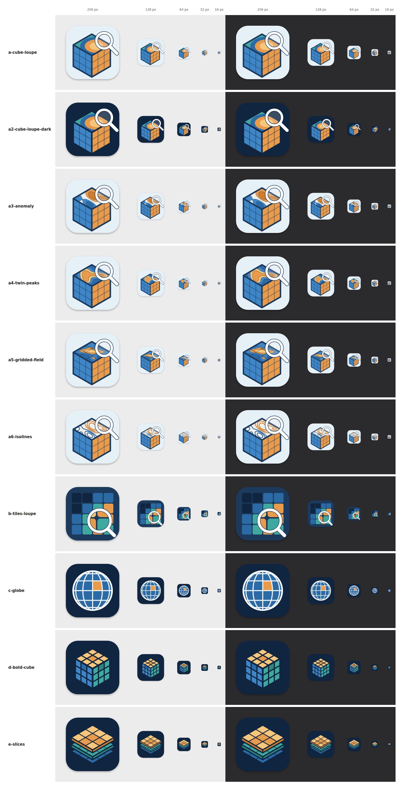

# App icon candidates

Design options for the GridLook app icon
([#14](https://github.com/abkfenris/gridded-quicklook/issues/14)). Nothing
here is wired into the app yet; this directory exists so the options can be
compared side by side, tweaked, and one of them promoted to
`apple/App/Assets.xcassets/AppIcon.appiconset/` once picked.



## The options

All of them riff on the Gemini concept attached to the issue (an isometric
gridded data cube with a colour field on top and a Quick Look loupe), pared
down to what survives 16 px.

| File                      | Motif                                                                                                                                                                        | Reads at 16 px as                     |
| ------------------------- | ---------------------------------------------------------------------------------------------------------------------------------------------------------------------------- | ------------------------------------- |
| `a-cube-loupe.svg`        | Closest to the concept: gridded blue/orange side faces, a colour field on top, a white loupe over the top-right corner. Light ground. The play button is dropped (it says "media player"). First draft: the top is three concentric bands, which reads as a bullseye; kept for reference. | Blue/orange cube with a white ring    |
| `a2-cube-loupe-dark.svg`  | Same artwork on a dark navy ground, for comparison against the other dark options and against the dark Dock.                                                                | Same, on navy                         |
| `a3-anomaly.svg`          | A-series, contoured top: a diverging anomaly map on a cream face. Warm bands in the right face's oranges, cold bands in the left face's blues, thin isolines. Like a sea-surface-temperature anomaly. | Cube with a cream top                 |
| `a4-twin-peaks.svg`       | A-series, contoured top: a sequential field from deep blue through sand to orange, two elongated peaks plus a small island, contours running off the face edges.             | Cube with a blue/orange top           |
| `a5-gridded-field.svg`    | A-series, contoured top: a broad warm ridge across a blue field, with the 3x3 grid faintly continued over the top so all three faces read as gridded.                       | Cube with a mostly blue top           |
| `a6-isolines.svg`         | A-series, contoured top: the A3 field as unfilled isolines only, orange and blue on cream. Topographic-map look; at 16 px the top is plain cream.                            | Cube with a cream top                 |
| `b-tiles-loupe.svg`       | Flat 4x4 field of rounded chunk tiles in a stepped cool-to-warm ramp, with the loupe zooming a 2x2 block. The "chunked array" reading of Zarr/Icechunk, no perspective.      | Coloured grid with a white circle     |
| `c-globe.svg`             | Graticule globe (parallels and meridians) with one grid cell lit orange. The earth-science reading; no loupe.                                                               | Blue disc with white lines            |
| `d-bold-cube.svg`         | Isometric cube with a 3x3 grid on every face and one hot chunk per face. Boldest silhouette; risks a Rubik's cube association.                                              | Three-colour cube                     |
| `e-slices.svg`            | Three gridded slabs stacked in perspective (time steps or chunks along a third dimension), the top one carrying a hot region. The "multi-dimensional" reading.              | Stack of diamonds                     |

Rendered 1024 px masters for each live in `masters/`; the one that gets
picked is the `AppIcon` master, as is.

## What every option shares

- **macOS shape.** 1024 canvas, 824 px rounded rectangle (radius 185.4)
  centred on a transparent ground, with the template's drop shadow, so the
  icon sits level with system icons in the Dock.
- **Flat, few colours, no text.** One navy/ink, one blue, one teal, one
  orange, one sand, plus white. No gradients; the "colour field" on the cube
  tops is three flat bands.
- **Layered.** Each SVG is grouped into `layer-shadow`, `layer-background`,
  `layer-midground`, and (where there is a loupe) `layer-foreground`, so the
  same artwork can be split into an Icon Composer `.icon` bundle for
  macOS 26 later, with the flat 1024 PNG as the fallback for macOS 13 to 15.

## Regenerating

The SVGs are emitted by `generate.py` (plain Python, no dependencies) so a
colour or geometry tweak is a one-line change. The contoured top faces are
real contours: each is a scalar field built from a few anisotropic Gaussian
bumps (`FIELD_*` at the top of the script), sampled on a grid, contoured
with a small marching-squares routine, and projected onto the isometric
face. Moving a bump or a level changes the map.

```sh
python3 docs/icon-options/generate.py
```

`render.mjs` rasterizes them with headless Chromium via Playwright (the
1024 masters into `masters/`, the smaller sizes into the untracked
`renders/`) and rebuilds `comparison.html` / `comparison.png`:

```sh
npx --yes playwright@1.56 install chromium   # once
node docs/icon-options/render.mjs
```

## Promoting one to the app icon

Once an option is chosen (per the plan in the issue):

1. Copy `masters/<option>.png` to
   `apple/App/Assets.xcassets/AppIcon.appiconset/AppIcon.png` with a
   `Contents.json` using Xcode's single-size (1024 `mac` universal) app icon.
2. Add `Assets.xcassets` to the GridLook target's `sources` in
   `apple/project.yml` and set `ASSETCATALOG_COMPILER_APPICON_NAME: AppIcon`.
3. Optionally, derive `.zarr` / `.icechunk` document icons from the same
   artwork and reference them with `UTTypeIconFile` on the exported UTIs in
   `apple/App/Info.plist`.
